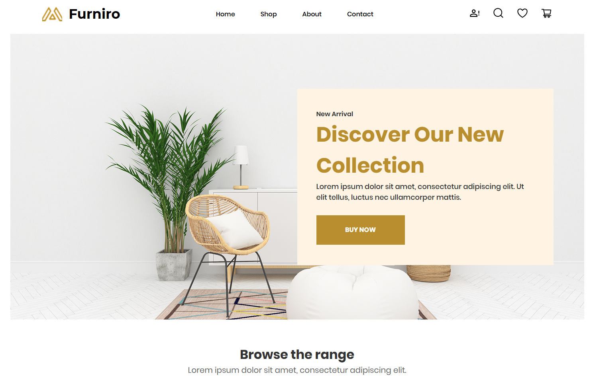

# Furniro – Furniture & Home Decor Website

## Screenshot

<p align="center">
  
</p>

🔗 [🌐 Live Demo – GitHub Pages](https://devtech-solution.github.io/Landing-Page-Furniture/)

---  
## Maquettte Figma  
🔗 [🌐 Maquette Figma](https://github.com/DevTech-Solution/Landing-Page-Furniture/blob/main/documents/maquette.jpg)

---  
## Maquette DEV  
🔗 [🌐 Maquette Dev](https://github.com/DevTech-Solution/Landing-Page-Furniture/blob/main/documents/schema_html.jpg)

---  

## 🇬🇧 English

**Furniro** is a static HTML website designed for a modern and elegant furniture brand.  
It features a structured and user-friendly home page, including navigation, product categories, featured items, inspiration galleries, and a newsletter subscription module.

> ⚠️ *Note: This project is not responsive yet. Responsive design will be implemented in future iterations.*

### ✨ Features

- Static top navigation bar
- Full-width hero banner with call-to-action
- Categorized product listings with images
- Product cards with discounts and details
- Interior inspiration gallery
- Newsletter subscription form with email validation
- Semantic and accessible HTML structure
- SEO-optimized meta tags

### 🛠 Technologies Used

- HTML5
- SCSS (compiled to CSS)
- Custom fonts (`fonts/styles.css`)
- Static images and icons (located in `/assets/images`)

### 📬 Newsletter Form Sample

```html
<form action="#" class="form-newsletter">
  <input type="email" placeholder="Enter your email address" required>
  <button type="submit">subscribe</button>
</form>
```

---

## 🇫🇷 Français

**Furniro** est un site web HTML statique conçu pour une marque de mobilier moderne et raffinée.  
Il offre une page d'accueil bien structurée, incluant une navigation claire, des catégories de produits, des articles mis en avant, des galeries d'inspiration, ainsi qu’un formulaire d’abonnement à la newsletter.

> ⚠️ *Remarque : Ce site n’est pas encore responsive. Le design adaptatif sera intégré dans les prochaines mises à jour.*

### ✨ Fonctionnalités

- Barre de navigation statique en haut de page
- Bannière principale avec appel à l'action
- Catégories de produits avec visuels
- Cartes de produits avec détails et prix remisés
- Galerie d’inspirations pour les intérieurs
- Formulaire d’abonnement avec validation email
- Structure HTML sémantique et accessible
- Optimisation SEO grâce aux balises meta

### 🛠 Technologies utilisées

- HTML5
- SCSS (compilé en CSS)
- Polices personnalisées (`fonts/styles.css`)
- Images et icônes statiques (`/assets/images`)

### 📬 Exemple de formulaire Newsletter

```html
<form action="#" class="form-newsletter">
  <input type="email" placeholder="Enter your email address" required>
  <button type="submit">subscribe</button>
</form>
```

---

## 📄 License

This project is licensed under the **MIT License**.  
You are free to use, copy, modify, merge, publish, and distribute this project for any purpose, with or without attribution.

---

🧪 This code has been tested on modern browsers including Chrome, Firefox, and Microsoft Edge.
